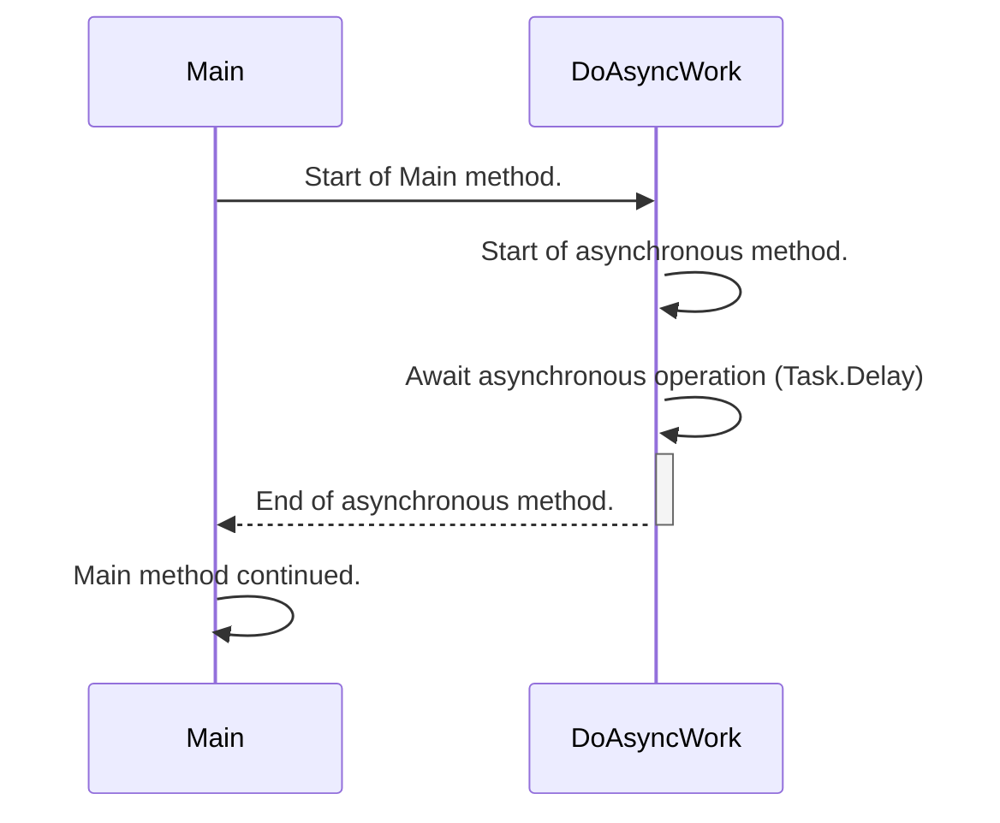
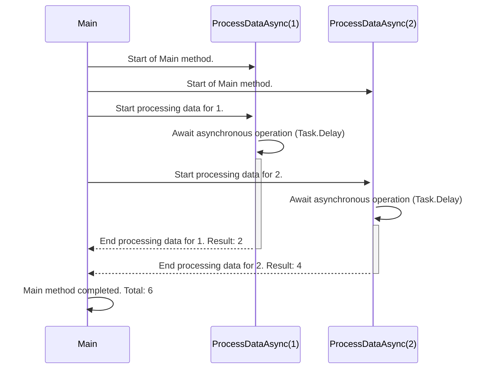

# 비동기 작동 순서 다이어그램

## 예제 1

아래는 간단한 C#의 비동기 프로그램 예제와 해당 작동 순서를 나타내는 다이어그램입니다.

```csharp
using System;
using System.Threading.Tasks;

class Program
{
    static async Task Main()
    {
        Console.WriteLine("Start of Main method.");

        await DoAsyncWork();

        Console.WriteLine("Main method continued.");
    }

    static async Task DoAsyncWork()
    {
        Console.WriteLine("Start of asynchronous method.");

        await Task.Delay(2000); // 비동기적인 작업 시뮬레이션

        Console.WriteLine("End of asynchronous method.");
    }
}
```

이 예제는 `Main` 메서드에서 `DoAsyncWork` 메서드를 비동기적으로 호출하는 간단한 비동기 프로그램을 보여줍니다.

이제 해당 프로그램의 내부 작동 순서를 나타내는 Mermaid 다이어그램입니다:



이 다이어그램에서는 `Main` 메서드가 시작되고, `DoAsyncWork` 메서드가 비동기적으로 호출되어 시작됩니다. 그리고 `DoAsyncWork` 메서드 내에서 `Task.Delay`를 사용하여 비동기적인 작업을 시뮬레이션한 후, 해당 메서드가 종료되어 `Main` 메서드가 계속 진행됩니다.

## 예제 2

아래는 좀 더 복잡한 비동기 프로그램 예제와 해당 작동 순서를 나타내는 다이어그램입니다. 이번에는 여러 비동기 메서드 간의 호출과 병렬 실행을 다루어 봅니다.

```csharp
using System;
using System.Threading.Tasks;

class Program
{
    static async Task Main()
    {
        Console.WriteLine("Start of Main method.");

        Task<int> result1 = ProcessDataAsync(1);
        Task<int> result2 = ProcessDataAsync(2);

        int total = await result1 + await result2;

        Console.WriteLine($"Main method completed. Total: {total}");
    }

    static async Task<int> ProcessDataAsync(int value)
    {
        Console.WriteLine($"Start processing data for {value}.");
        await Task.Delay(value * 1000); // 비동기적인 작업 시뮬레이션
        Console.WriteLine($"End processing data for {value}.");

        return value * 2;
    }
}
```

이제 해당 프로그램의 내부 작동 순서를 나타내는 Mermaid 다이어그램입니다:



이 다이어그램에서는 `Main` 메서드가 시작되고, 두 개의 `ProcessDataAsync` 메서드가 병렬로 비동기적으로 호출됩니다. 각 메서드 내에서는 `Task.Delay`를 사용하여 비동기적인 작업을 시뮬레이션하고, 각각의 결과가 `Main` 메서드에서 합산되어 최종적인 결과가 출력됩니다.